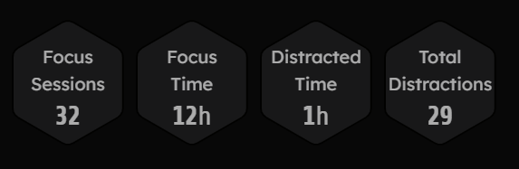
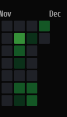

# 11.25.2024

10 followers challenge:
- got 4 new followers
- I used it more as a socializing function. I would basically talk to people and try to make a good first impression, joke around with them, etc. Basically just trying to make friends. Instead of directly asking for their instagram's I added them on insta after talking to them and they all accepted and followed me back.
- Once I was talking to people I had a pretty easy time talking to them and joking around since for the most part i was being myself
- I think I should've approached more people, but I was also really busy this last week with a few tests and a project so I was only really talking to new people during lunch 

TORI STATS:

NOTE: I forgot to use tori to track a lot of stuff throughout the week, so this is a lot less focus time than I actually had. 

What is my definition of truth? What is my system for figuring out the truth?

I think the truth is sometimes a little harder to find than one would expect. Often times our brains will "edit" the raw information being fed to you. When someone claims something, you almost always immediately have a gut reaction, or an emotion. That emotion determines whether or not you deny or support that claim. When people hear something they don't like, they often try to reason why that thing isn't true. People go to great extents to defend this reasoning too, even though it's based in your opinion on the subject. I'm guilty of this too.

Your emotions determining truth is NOT ideal in any scenario. So, I would say my definition of truth is facts that haven't been modified by emotions and biases. If your brain is like a camera with some filters on it, the truth would be the raw footage.

So how does one strip away the emotions and biases from their raw information? With any bias, slowing down and thinking things through does wonders for this. When you hear something that triggers a negative or positive reaction, slowing down and trying to understand each part of the statement. Once you realize that you have a bias towards a subject, it becomes easy to suppress that bias, and learn unfiltered facts about said thing. The hard part, is realizing you have the bias in the first place.